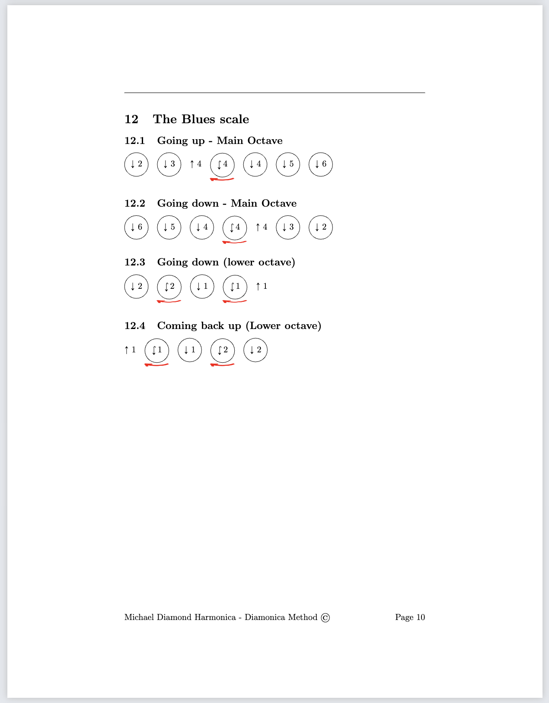

# Welcome to My Blog

Here I will provide an overview of some of programming and data science projects, and share some of my accomplishments in Psychological, Statistics, and Research Methods.

## High-Quality Harmonica Tablature Notation Using LaTeX: An Exploration of Code and Design

The first project I would like to share is something I wrote in LaTeX to produce High-Quality Harmonica Tablature Notation Using LaTeX.I authored a LaTeX package dedicated to the creation of high-quality harmonica tablature notation, a specialized form of sheet music for harmonica players. The inception of this package aimed at assisting authors who craft instructional books on harmonica playing, enabling them to swiftly inscribe desired notes. Achieving this visual representation in LaTeX is intricate given the potential complexity of the notation. Prior to the development of this tool, hand-written tablature was the unrivaled method in terms of precision and clarity over any digital alternatives.

You can find the readme file here: 

Here is the Repo:

- [ ] TODO: ADD URLS

## Harnessing LaTeX's Power for Harmonica Tablature

LaTeX is especially powerful when it comes to using code to elegantly render complex mathematical formulas. I tapped into this capability to design the harmonica tablature notation package. Central to this project was the `tikz` package, which enabled detailed graphical representations. The `geometry` and `fancyhdr` packages ensured a clean layout, while `inputenc`, `fontenc`, and `lmodern` were used to guarantee clarity and precision in font representation.


## Here is an example of a page generated using this code:




This is an example of a function that generates the output

```latex
\newcommand{\4}{{ \circled{ $\downarrow$ 4 } } }

```

Then to generate the tableture you call the function 

```latex
\4
```

Here is a more complex example. Warble, a technique unique to the harmonica, is a rapid alternation between two adjacent holes. This segment is a testament to the intricacies of harmonica notation, showcasing a bend that transitions into a warble. 

```latex
\newcommand{\bendintowarble}
{
    {
        {\uarr 
            {\circled
                {\hookdownarrow$ 4} 
            }
            \nearrow$
        { 
            \circled{ $\downarrow$ 4 } 
        } $\rightarrow$
        \circled{w$\downarrow$5454...} 
        }
    }
}

```

Then to generate this complex tableture you call the function 
```latex
\bendintowarble
```


- [ ] TODO: INCLUDE A PICTURE EXAMPLE


## Control Flow for Modular Content Management
In this template, I've woven in an advanced feature: the control flow. This mechanism uses object orientated programming philosphohy to text LaTeX for a modular approach to content management. Imagine having segments of your lessons stored akin to records in a database. These individual records, or in our case, content pieces, are kept in separate text files. This means you can summon specific content on demand, tailoring outputs to suit different needs. For instance, the "blues scale" mini lesson, stored as its own module, can be integrated into both workshops and books. And with the control flow, updating or refining this lesson ensures it’s reflected wherever it's used.

## Breaking Down the Control Flow
Here's a brief breakdown of this system:

- **Main File**: This acts as the central conductor, amalgamating different workflow files and ensuring the content generated is harmonized.
- **Control Flow Files**: Each file is dedicated to shaping the content for a specific output. For instance, when crafting a book, the `\import{}` command integrates the necessary lessons.

### Using Control Flow: Crafting a Harmonica Book

1. In the main file, activate the command `\input{0_latex_control_flow/2_book_control_flow.tex}`.
2.  Within the book control flow, the appropriate mini-modules will be called. For example:

```latex
\newpage
\import{0.1_active_lessons_modules/2Rhythm/}{1FunkyRhythm}

\newpage
\import{0.1_active_lessons_modules/4_the_blues_scale}{1_blues_scale_overview.tex}

```
This sets the stage for a harmonica book, introducing notation, rhythm lessons, and the detailed blues scale module.

3. After compiling the main file, you're presented with a meticulously structured harmonica book, designed as per the directives.

## Demonstrating Skill Mastery for Prospective Employers

The development and implementation of this control flow mechanism underscore my capability to construct complex, user-friendly systems. Its adaptability and efficiency mirror my dedication to high-caliber code and an optimal user experience. This template stands as both a reflection of my passion for the harmonica and a vivid demonstration of my technical expertise, strategic planning, and vision for adaptability.


